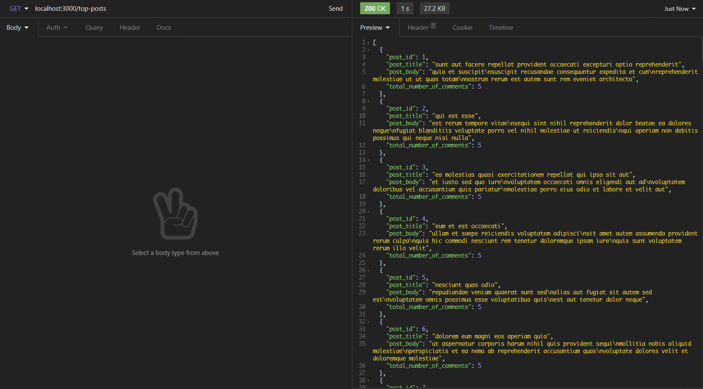
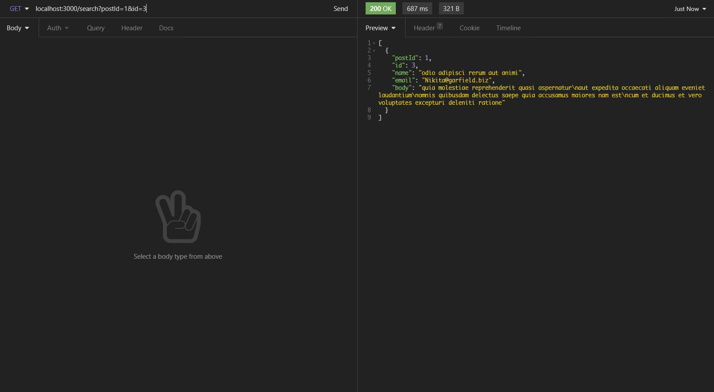

## Solution for https://github.com/tribehired-devs/backend-test

Endpoints:
`/top-posts`
Get top posts ordered by number of comments it received.

Example:
`GET /top-posts`



`/search`
Get result from comments endpoint given query string.

Example:
`GET /search?postId=1&id=3`


To start:

```bash
npm install
npm start
```

Unit test for main function:
```bash
npm test
```
